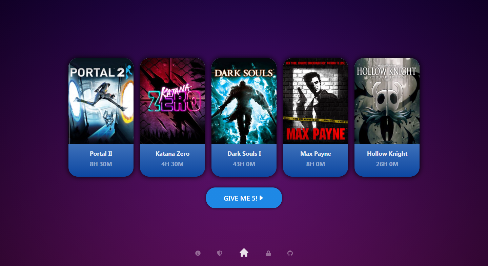

<!-- PROJECT SHIELDS -->
<!--
*** I'm using markdown "reference style" links for readability.
*** Reference links are enclosed in brackets [ ] instead of parentheses ( ).
*** See the bottom of this document for the declaration of the reference variables
*** for contributors-url, forks-url, etc. This is an optional, concise syntax you may use.
*** https://www.markdownguide.org/basic-syntax/#reference-style-links
-->
[![Contributors][contributors-shield]][contributors-url]
[![Forks][forks-shield]][forks-url]
[![Stargazers][stars-shield]][stars-url]
[![Issues][issues-shield]][issues-url]
[![MIT License][license-shield]][license-url]


<!-- PROJECT LOGO -->
<br />
<p align="center">
  <a href="https://github.com/SandNoodle/RR5G">
    
  </a>

  <h3 align="center">Recommend Random 5 Games</h3>

  <p align="center">
    Simple recommendation app for picking new games to play.
    <br />
    <a href="https://github.com/SandNoodle/RR5G"><strong>Explore the docs »</strong></a>
    <br />
    <br />
    <a href="https://github.com/SandNoodle/RR5G">View Demo</a>
    ·
    <a href="https://github.com/SandNoodle/RR5G/issues">Report Bug</a>
    ·
    <a href="https://github.com/SandNoodle/RR5G/issues">Request Feature</a>
  </p>
</p>


<!-- TABLE OF CONTENTS -->
<details open="open">
  <summary><h2 style="display: inline-block">Table of Contents</h2></summary>
  <ol>
    <li>
      <a href="#about-the-project">About The Project</a>
      <ul>
        <li><a href="#built-with">Built With</a></li>
      </ul>
    </li>
    <li>
      <a href="#getting-started">Getting Started</a>
      <ul>
        <li><a href="#prerequisites">Prerequisites</a></li>
        <li><a href="#installation">Installation</a></li>
      </ul>
    </li>
    <li><a href="#usage">Usage</a></li>
    <li><a href="#roadmap">Roadmap</a></li>
    <li><a href="#contributing">Contributing</a></li>
    <li><a href="#license">License</a></li>
    <li><a href="#contact">Contact</a></li>
    <li><a href="#acknowledgements">Acknowledgements</a></li>
  </ol>
</details>


<!-- ABOUT THE PROJECT -->
## About The Project



This project aims to create easier and faster way for picking new games to play. Created due to having too many entries on my to-be-played list with combined indecision about picking them.


### Built With

#### Backend:
* [Java 11](https://openjdk.java.net/projects/jdk/11/)
* [Gradle](https://gradle.org/) 
* [Spring](https://spring.io/)
  * [Boot](https://spring.io/projects/spring-boot) 
  * [Security](https://spring.io/projects/spring-security) 
* [JUnit 5](https://junit.org/junit5/) 

#### Frontend:
* [React](https://reactjs.org/)
  * [Styled Components](https://styled-components.com/)
  * [React Router Dom](https://reactrouter.com/web/guides/quick-start)
  * [React Bootstrap](https://react-bootstrap.github.io/)
* [Axios](https://github.com/axios/axios)

#### Database:
* [PostgreSQL 13](https://www.postgresql.org/)


<!-- GETTING STARTED -->
## Getting Started

To get a local copy up and running follow these simple steps.

### Prerequisites

Make sure that you installed dependencies listed bellow:

#### Backend
* [Java 11](https://openjdk.java.net/projects/jdk/11/)
* [Gradle](https://gradle.org/) 

#### Frontend
* [npm](https://www.npmjs.com/)

#### Database
* [PostgreSQL 13](https://www.postgresql.org/)

### Installation

1. Clone the repo
   ```sh
   git clone https://github.com/SandNoodle/RR5G.git
   ```
2. Frontend: 
     1. Navigate to frontend directory
    ```sh
    cd frontend/
    ```
    2. Install NPM packages
    ```sh
   npm install
    ```
     1. Build app using npm
     ```sh
        # Production
        npm run build
    ```
3. Backend:
     1. Navigate to backend directory
    ```sh
      cd backend/
    ``` 
     1. Edit configuration file **application.properties** located in **src/main/resources/** directory.
    ```
      spring.datasource.url=jdbc:postgresql://localhost:5432/gamerecommendation
      spring.datasource.username=your_username
      spring.datasource.password=your_password
    ```
     1. Build app using Gradle.
   ```sh
      gradlew bootJar
   ```

### Run

1. Start database server.
2. Start backend server:
```sh
  cd backend/build/libs
  java -jar built_app_name.jar 
```
3. Start frontend either as production or development server:
```sh
  cd frontend
  # Production
  npm run build
  # If you don't have serve run: npm install -g serve
  # before running line below
  server -s build
    
  # Development
  npm start
```

Your server should be running at http://localhost:3000/ while in development mode **or** https://localhost:3000/ while in production mode.

<!-- USAGE EXAMPLES -->
## Usage

  Additionally you can acess admin dashboard by going to http://localhost:3000/admin or https://localhost:3000/admin and signing in.

  **NOTE:**
  If there's no admin account in the database you will prompted to provide credentials for creating it.


<!-- ROADMAP -->
## Roadmap

See the [open issues](https://github.com/SandNoodle/RR5G/issues) for a list of proposed features (and known issues).


<!-- CONTRIBUTING -->
## Contributing

Contributions are what make the open source community such an amazing place to be learn, inspire, and create. Any contributions you make are **greatly appreciated**.

1. Fork the Project
2. Create your Feature Branch (`git checkout -b feature/AmazingFeature`)
3. Commit your Changes (`git commit -m 'Add some AmazingFeature'`)
4. Push to the Branch (`git push origin feature/AmazingFeature`)
5. Open a Pull Request


<!-- LICENSE -->
## License

Distributed under the MIT License. See `LICENSE` for more information.


<!-- CONTACT -->
## Contact

Project Link: [https://github.com/SandNoodle/RR5G](https://github.com/SandNoodle/RR5G)


<!-- ACKNOWLEDGEMENTS -->
## Acknowledgements

* [React Icons](https://react-icons.github.io/)
* [Material Desgin](https://material.io/)

<!-- MARKDOWN LINKS & IMAGES -->
<!-- https://www.markdownguide.org/basic-syntax/#reference-style-links -->
[contributors-shield]: https://img.shields.io/github/contributors/SandNoodle/rr5g.svg?style=for-the-badge
[contributors-url]: https://github.com/SandNoodle/rr5g/graphs/contributors
[forks-shield]: https://img.shields.io/github/forks/SandNoodle/rr5g.svg?style=for-the-badge
[forks-url]: https://github.com/SandNoodle/rr5g/network/members
[stars-shield]: https://img.shields.io/github/stars/SandNoodle/rr5g.svg?style=for-the-badge
[stars-url]: https://github.com/SandNoodle/rr5g/stargazers
[issues-shield]: https://img.shields.io/github/issues/SandNoodle/rr5g.svg?style=for-the-badge
[issues-url]: https://github.com/SandNoodle/rr5g/issues
[license-shield]: https://img.shields.io/github/license/SandNoodle/rr5g.svg?style=for-the-badge
[license-url]: https://github.com/SandNoodle/rr5g/blob/master/LICENSE.md